Stuff for Minecraft
===================

This repo contains a Dockerfile + Kubernetes Resources, and various utilities to drive the mincraft server.jar and provide ruby scripting environment to PlaceBlock events

[Tunneling](https://www.youtube.com/watch?v=wrvlkLELqwg&feature=youtu.be) [Tunneling 2](https://www.youtube.com/watch?v=VCY2VKXJkSw&feature=youtu.be)

[Glass floor](https://www.youtube.com/watch?v=jj0q3xPUeY8&feature=youtu.be)

[Other Vid](https://www.youtube.com/watch?v=VCY2VKXJkSw&feature=youtu.be)

\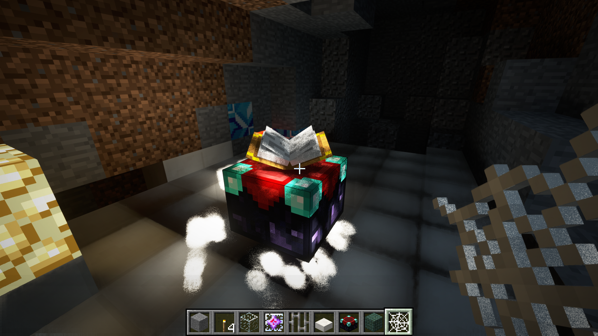
\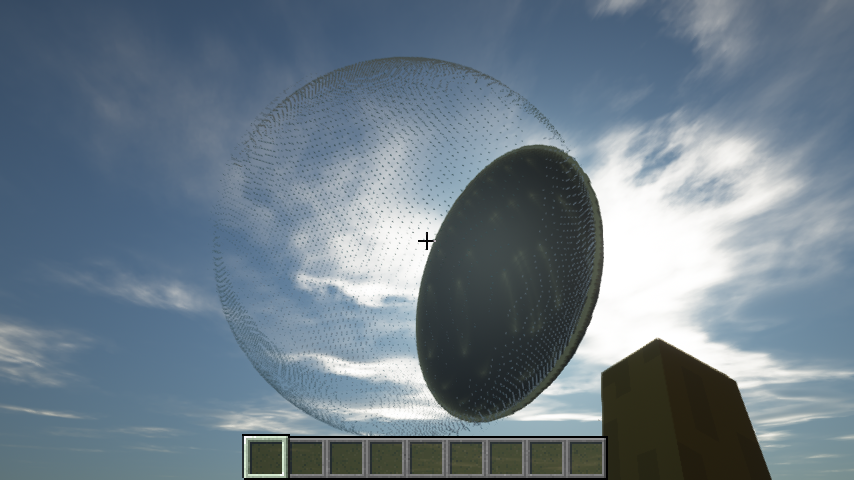
\
\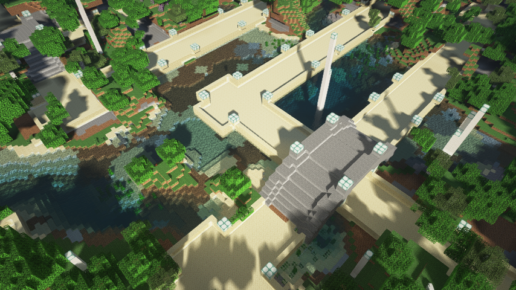
\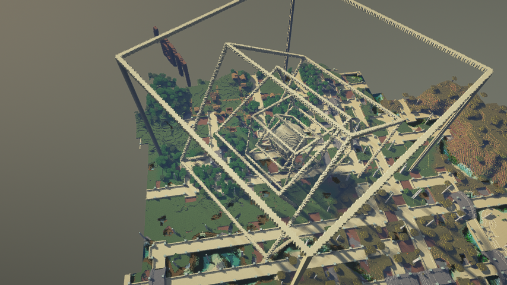
\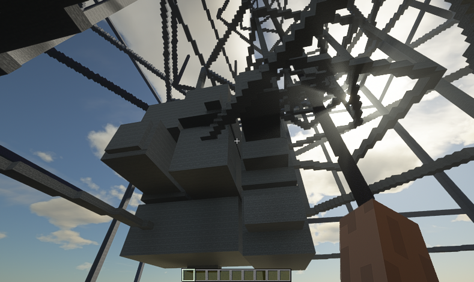
\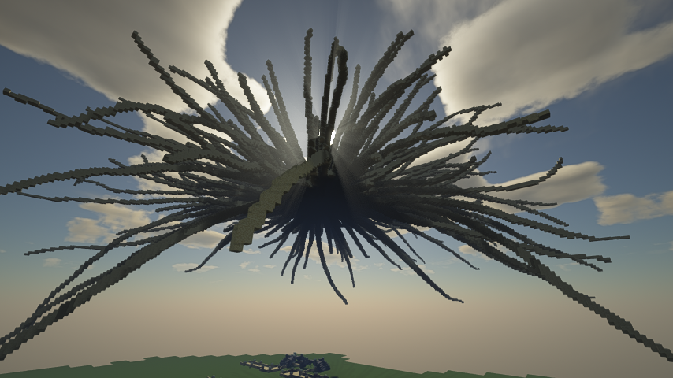
\
\
\
\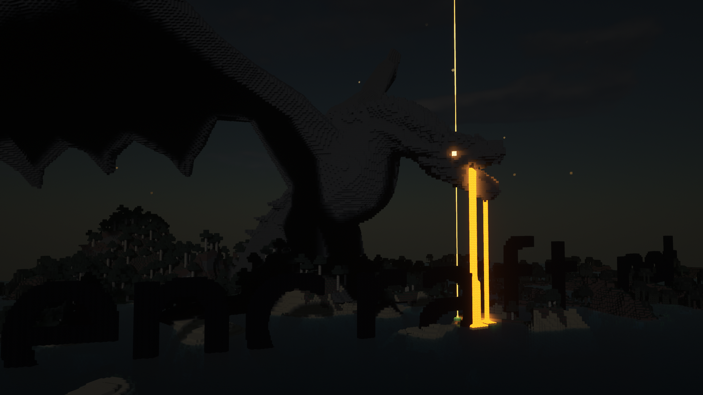
\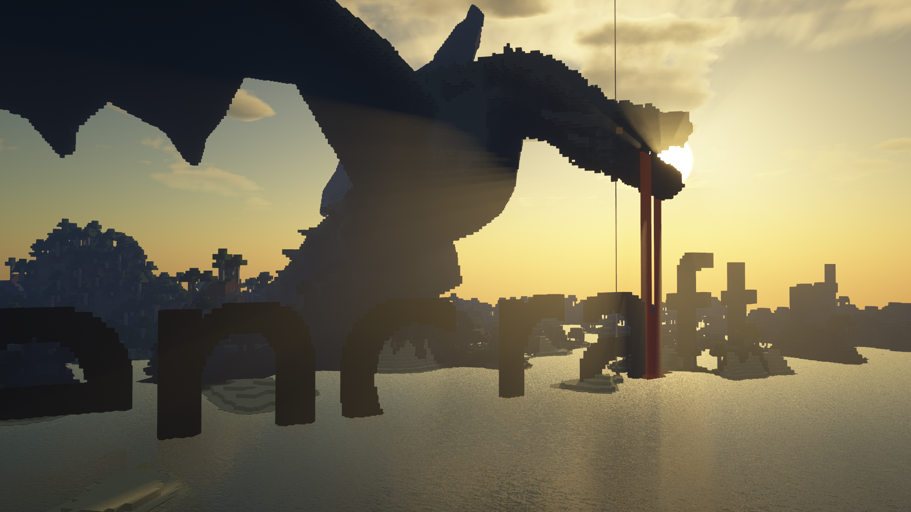
\
\
\
\
\
\
\
\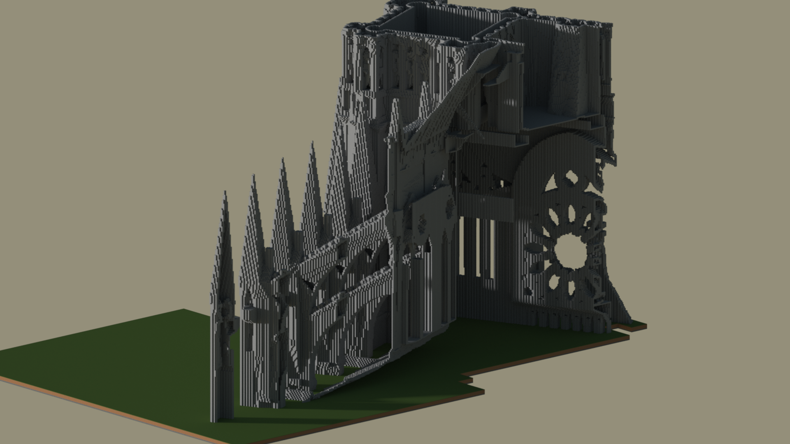
\
\
\
\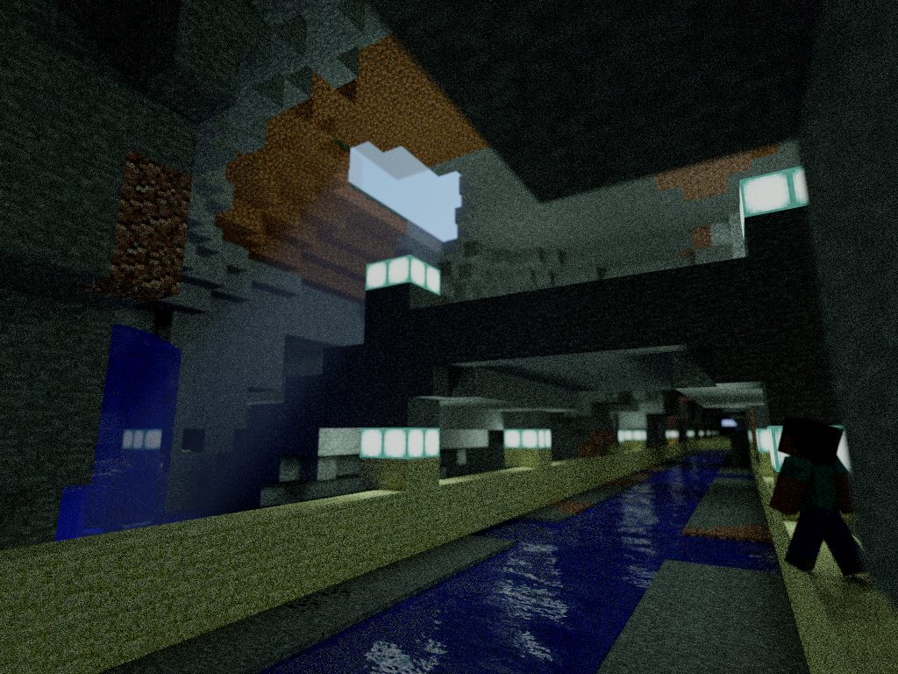
\
\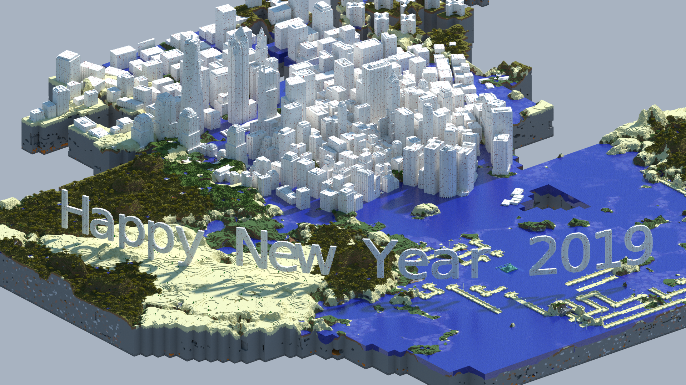
\
\
\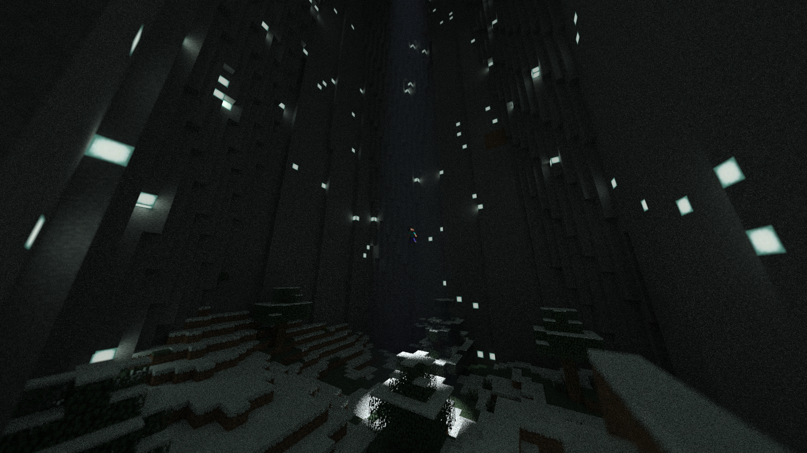
\
\
\
\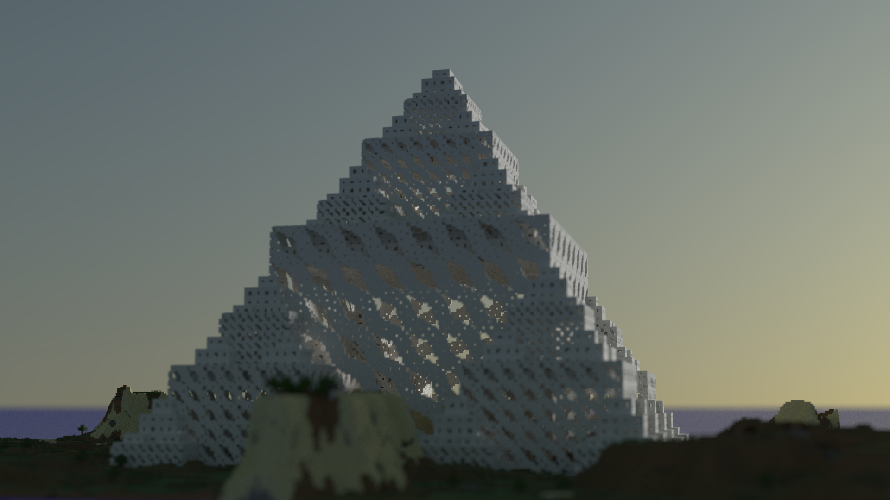
\
\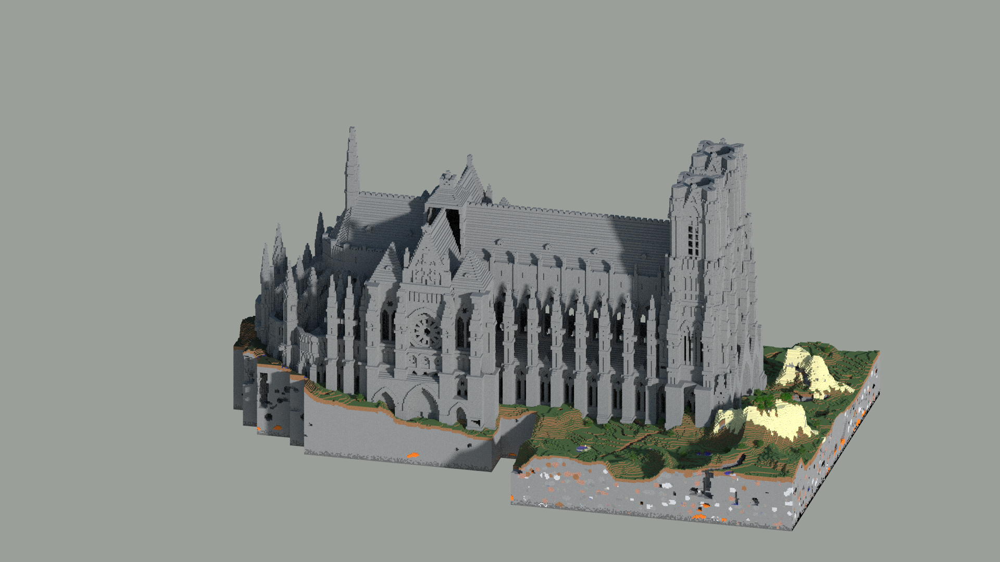
